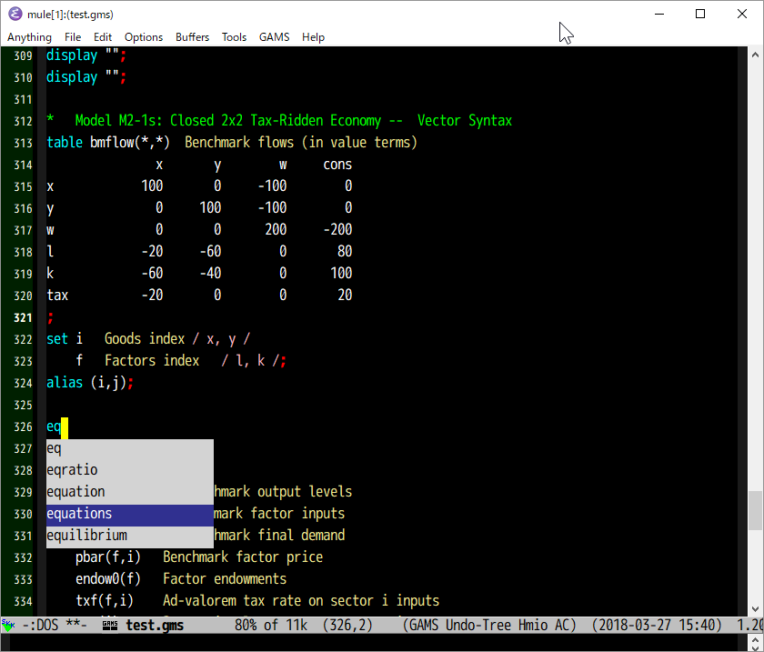

<!--
Author: Shiro Takeda
Maintainer: Shiro Takeda
First-created: 2018-03-26.
Time-stamp: <2018-04-21 14:39:25 st>
-->

What is gams-ac.el?
============================================================

This lisp provides an auto-complete source for GAMS mode.
- [GAMS mode for Emacs](https://github.com/ShiroTakeda/gams-mode/).
- [auto-complete mode](https://github.com/auto-complete/auto-complete/).

Screenshot
============================================================

Installation
=============

First, you need auto-complete mode (`auto-complete.el`) and GAMS mode
(`gams-mode.el`). I recommend using packages from [MELPA][melpa].

<!-- You can install `gams-ac` from [MELPA][melpa]. If you choose not to use MELPA, -->
<!-- you can install from GitHub ([gams-ac](https://github.com/ShiroTakeda/gams-ac)). -->

To use `gams-ac`, put the following code in your init.el to

    (require 'gams-ac)
    (gams-ac-after-init-setup)

<!-- If you install `gams-ac` from MELPA, just put the following code. -->

<!--     (gams-ac-after-init-setup) -->
    

Usage
=====

`gams-ac` should now automatically be enabled when you visit a buffer
in which `gams-mode` is active and `auto-complete` is enabled.

If you want to add more keywords, for example, "computable", "general",
"equilibrium", Add the following into your init.el.

    (setq gams-ac-source-user-keywords-list
            '("computable" "general" "equilibrium"))

[melpa]: http://melpa.org

<!--

--------------------
Local Variables:
fill-column: 80
mode: markdown
End:

-->
